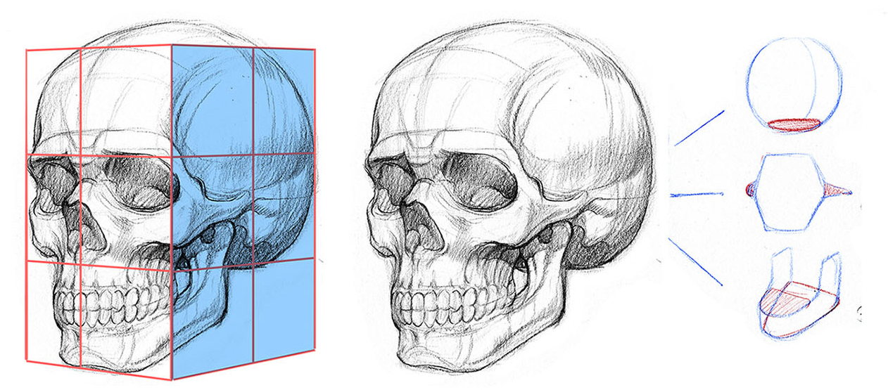
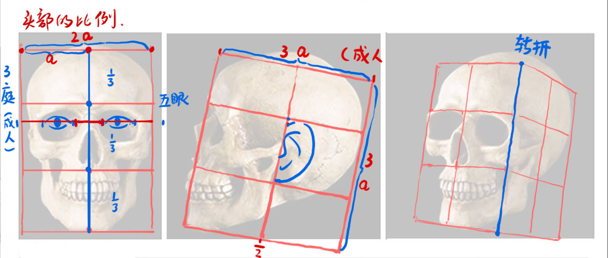
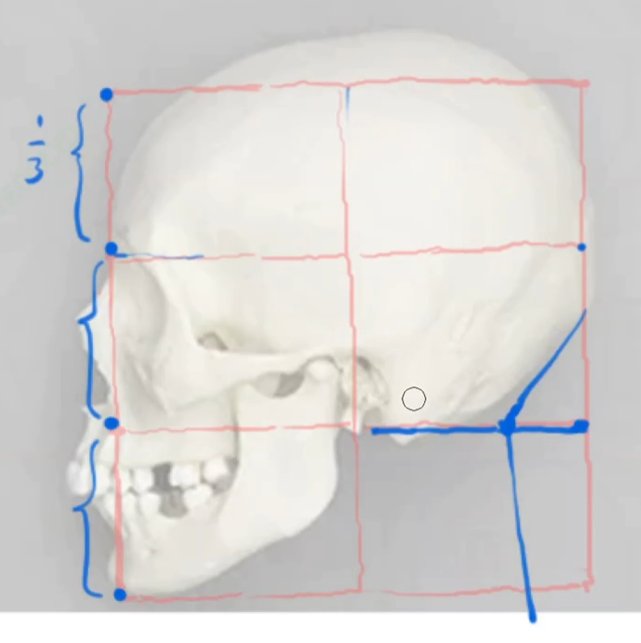
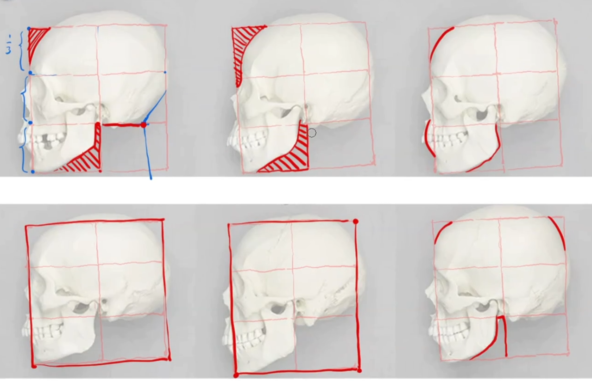

# 第一课 头部结构拆解

## 简化头骨组成

为了更方便地理解头骨，可以将头骨简化为以下模型：头顶的球体、面骨以及下颌骨，这三大区域

  

## 头骨的区块

> 💡 下面说到的比例，如无特殊说明，均以理想的成年人作为模型
> ⚠ 但实际上每个角色都有其特征，所以下面说到的数据均不能死板地套用在所画的角色身上，后面的课程中提到的比例数据同理

从正视图看，可以将头骨纵向划分为三个区域，亦即*三庭*

+ 上庭：指从发际线到眉弓这一块区域

+ 中庭：指从眉弓到鼻低这一块区域

+ 下庭：指从鼻低到下巴这一块区域

而从横向看，则可以以一只眼睛的宽度作为基准，将头骨横向划分为五个区域，亦即*五眼*

> 💡 这里的眼管是指在皮肉健全的状态下一只眼睛的宽度，而非只有骨头的状态

  

从侧视图看，耳朵侧视图的中间，正好中庭的位置

而脖子的起点则位于头顶球体部分与*鼻低延长线* **相切**的地方

  
  
要准确抓住一个角色部的头部特征，也可以借由切分侧视图，并利用切分线与头骨质检的负型来分析

  

> 💡 一般来说，男性的头骨通常会比女性的头骨更强壮，如具有更宽大的下颚等

## 如何分析真人照片所在的方块空间

在分析真人照片的时候
