# 第二课 五官结构和运用

## 从头骨开始

  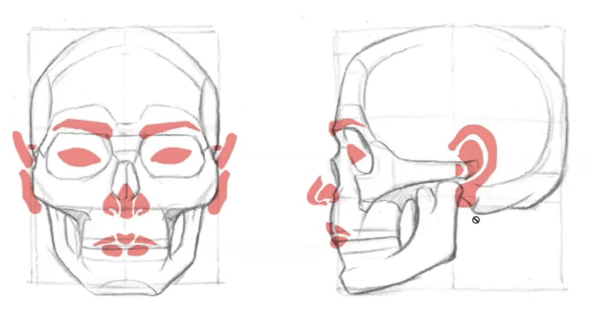

在描画五官之前，我们需要先注意到头骨上不同性别、年龄之间不同的比例以及风格化的骨性特征的差异

如果头骨的基础画得不对，那么后面的塑造就算再怎么调整五官的风格，都无法画出理想的造型

  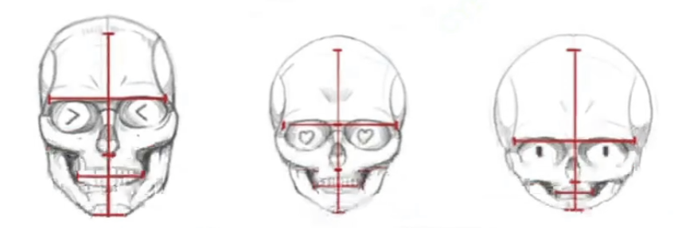

  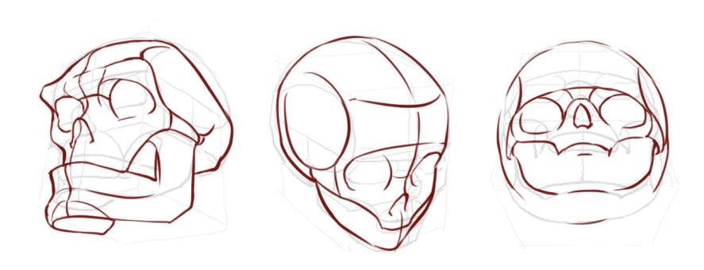

## 基础辅助线

为了不把五官画歪，我们还需要合理利用辅助线

  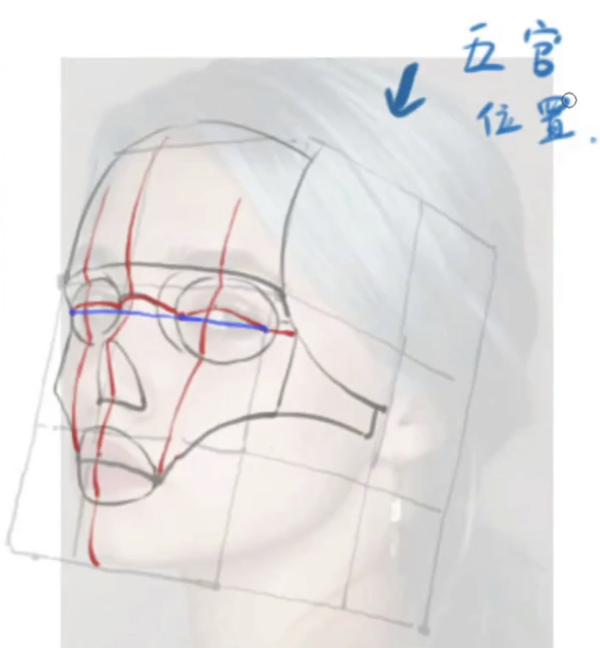

这两条辅助线始于眉毛的**中点**，并根据五官和面部的**起伏**，**平行**于面部中线，终于两边的**嘴角**

  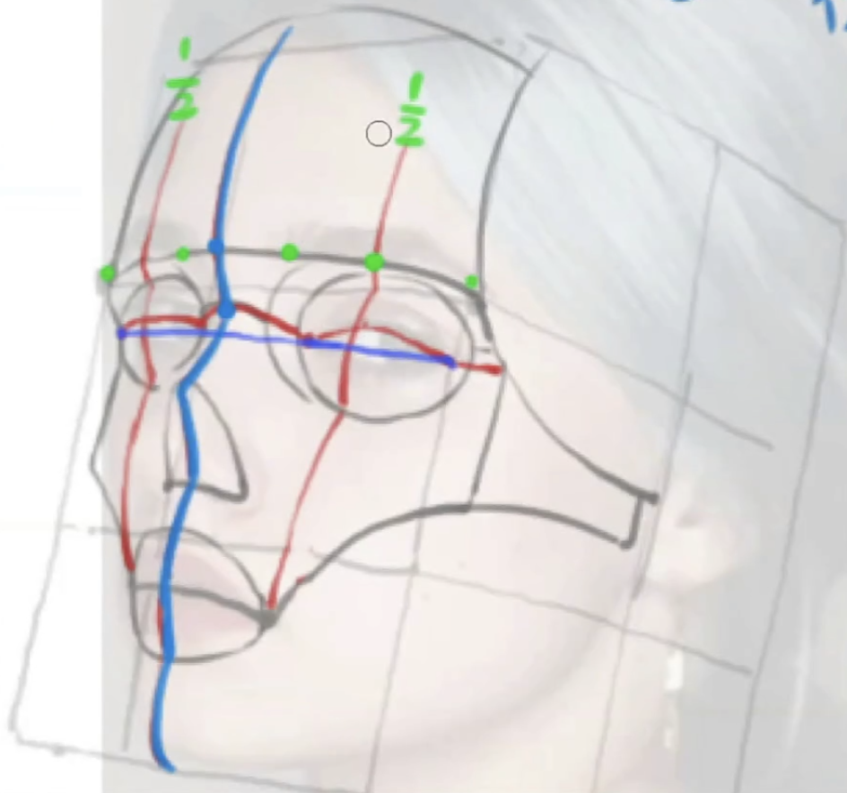

而贯穿眼角的**直线**，有助于我们定位两边眼睛以及更为凸起的鼻梁骨

它们也能帮助我们控制嘴巴的宽度，从而避免在绘画时，把嘴巴画得过宽

## 眉毛

### 眉毛比眼睛更重要？！

眉毛不仅可以在暗示头部空间结构的方面起到巨大的作用

而且在表情方面，因为我们的眼皮被【需要补充肌肉名字】所带动，所以眉毛的动作区域会比眼睛更大更夸张

  

### 眉毛的形状

现实中的人类的眉毛前段与末端的生长趋势并不一样的

一般来说，前端往上生长；到了末端则转而向下生长

  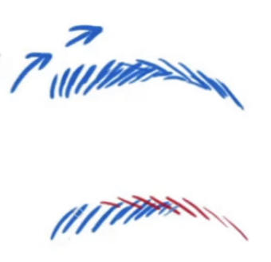

在设计眉毛的造型时，我们可以把眉毛拆分为三块区域来设计

（下图为角色左侧眉毛的简化）

  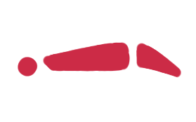

在画眉毛的时候，我们应该要注意头部的透视关系

眉毛贴合在眉弓上生长，而眉弓是有弧度的，我们应该重视眉毛是否已经转到看不见的角度里面去，避免画出破坏透视关系的眉毛

  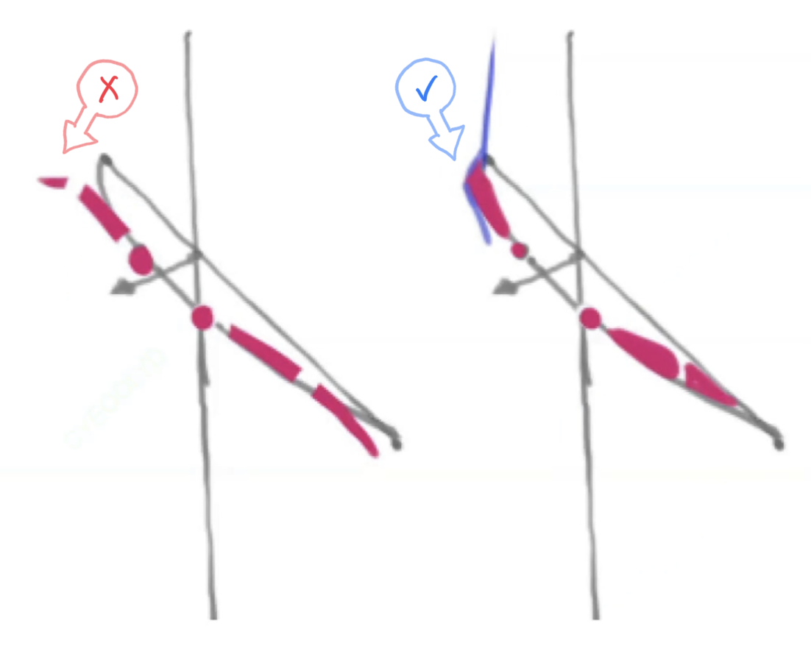

### 利用“中字练习法”快速把握眉毛的透视感

平常练习的时候，可以先简易地画出一个“中”字形的透视空间（三庭里面的中庭以及中线）

然后画出眉弓以及两边的透视收缩效果，以此达到快速练习的目的

  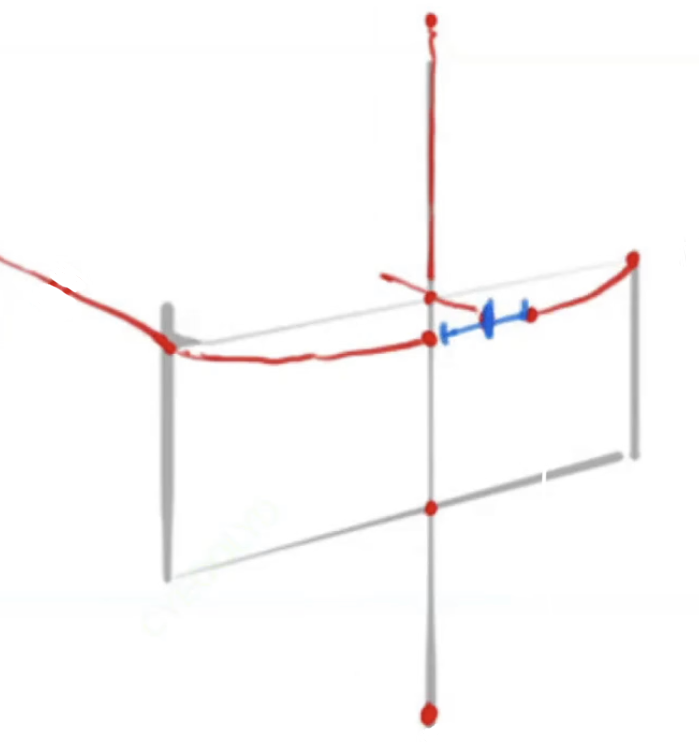

## 眼睛

### “眼黑”的部分

我们首先要明白眼珠是一个球体，而眼黑的部分则是一个贴在这个球体上面的圆

因此，在练习不同角度的眼睛形态的时候，我们可以通过在有经纬线的球体上，画出符合经纬线所组成的方格的圆形

  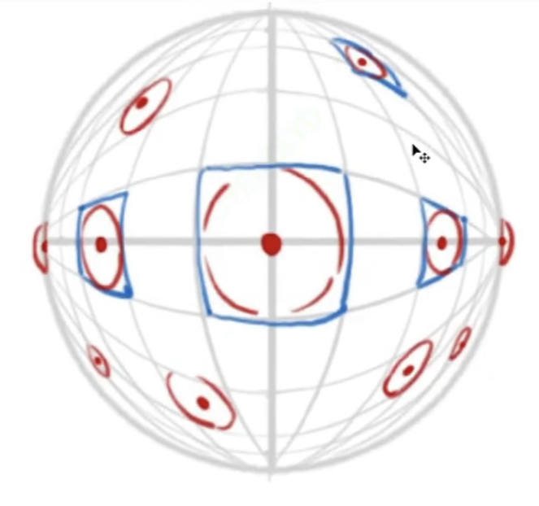

实际作画时，还需要注意瞳孔的实际位置

瞳孔的位置并不在眼黑凸出来的部分，它所在的位置会比上面画的圆形的面要低一些

所以在画眼睛特写的时候应该注意给瞳孔的位置做出适当的偏移

### 眼皮的部分

眼皮可以理解成一片**树叶**（基本款，也会有接近圆形、菱形等形状的眼皮组合）贴合在眼球上 

它同样会因为在不同的观察角度呈现出不同的透视形变

同样地，我们可以利用上面在球体上画圆的方法来练习眼皮在不同观察角度下的形变

  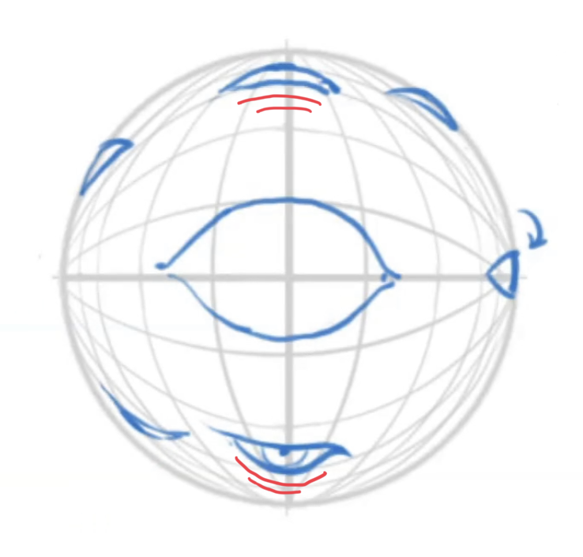

### 眼睛草稿的作画流程

除了先画出球体和参考的十字线以外

为了更好地定位，作画时可以先定出两侧眼角的位置

  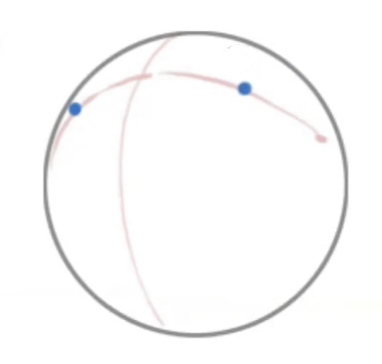

接着根据透视画出叶片的形状，这里要注意叶片**最鼓起**的部分应该落在**十字参考线**上

  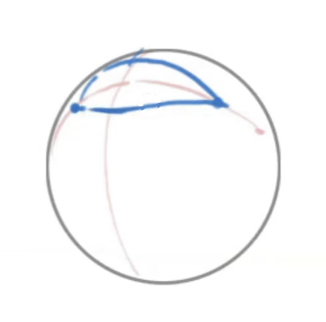

然后补全“眼黑”的部分，并且注意瞳孔的位置是否需要偏移

  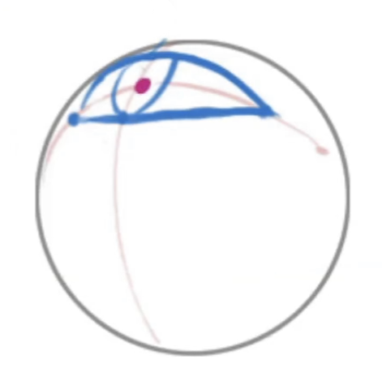

### 眼睛的补充

睫毛的生长方向为扇形往外生长

如果睫毛的生长方向越来越接近视中轴的话，必然会压缩成一片黑色的区域，长度也会被压缩

因此，描画睫毛的时候应该注意不同方向睫毛的长度以及朝向

  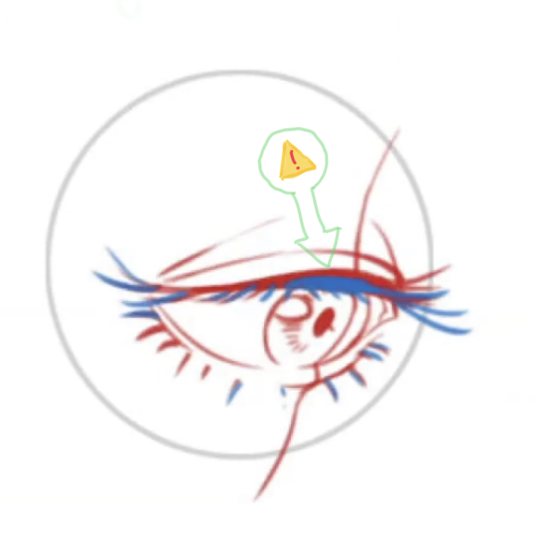

其次，在某些需求下，还要注意表现眼皮的厚度

在线稿中可以利用加粗线条等方式表现，在光影练习中，则需要注意安排投影的位置

正课1·32·35
