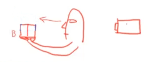
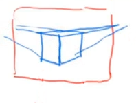
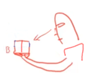
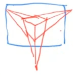

# Krenz 基础透视与结构

## 第一课

### 传统美术教学中常见的三种透视的定义

+ **一点透视**，指在 *X轴* 方向的平行线都平行于画面，*Z轴* 方向的的平行线都垂直于画面，只有 *Y轴* 方向上的平行线有一个消失点

  

+ **两点透视**，指在 *Z轴* 方向上的平行线都垂直与画面，但 *X轴* 和 *Y轴* 上的平行线都各自拥有一个消失点
  
  

+ **三点透视**，指在 *X轴* 、 *Y轴* 和 *Z轴* 三个方向上的平行线，均有对应的消失点
  
  

## 透视的成因

### 单点透视

假设目前有一个摄像机（或人眼），观察两个不同位置的立方体 *A（蓝色）* 和 *B（红色）* （箭头代表摄影机<u>平视前方</u>）

> 💡人眼观察的画面没有<u>画面边框</u>，因此在某些场合里不好描述，所以后面的课程默认以摄像机作为观察者

  

当观察 *A位置*  时，画面应该如下图一样

  

> 💡最外侧的红色边框为画面边缘，下同

当立方体从 *A位置* 往下移动到 *B位置* 时，摄像机角度<u>保持平视</u>不变，画面应该如下图一样

在能完全观察到立方体正面的同时，也能够观察到一部分立方体的顶面

  

当方块继续往下移动时（人眼的视锥角大约为60°）

    

画面最终就会如下图所示，我们可以观察到立方体更多的顶面

且因为观察的视线始终跟立方体的正面保持*垂直*，所以Z轴的线条不会产生明显的收缩（
但物体已经超出画布的边缘）

    

以上就是传统美术中所说的单点透视

当立方体的其中一个平面与摄像机的观察方向保持**垂直**，物体 *移动<strong>且不发生旋转</strong>* 的时候，就会在平面上产生单点透视的图像

### 两点透视

现在让立方体往上移动回 *B位置* ，并且把它往左或往右 **旋转** 45°

  

就会得到在 *X轴* 和 *Y轴* 的平行线都会出现消失点的图像

  

因为此时摄像机的观察方向**仍然**与立方体**垂直**，所以此时 *Z轴* 仍然没有出现透视收缩现象

以上就是传统美术中所说的两点透视的

### 三点透视

现在接着上一步，保持立方体的位置不动，将视角从平视改为**俯视**

  

此时我们观察到的图像，就会变成三个方向的平行线均有消失点的效果

  

### 本段小结

透视是由物体与摄像机之间的**相对位置与角度**产生的

当物体发生旋转，或摄像机的观察角度和距离发生改变时，物体呈现在画面上的透视效果就会改变

如果无法很好地想象出对应的画面效果，可以购买一个魔方，并用手机摄像头从不同的角度拍摄，然后把所得的照片进行对照分析

手机摄像头的默认设定一般会比人眼直接观察的透视感更**强烈**
